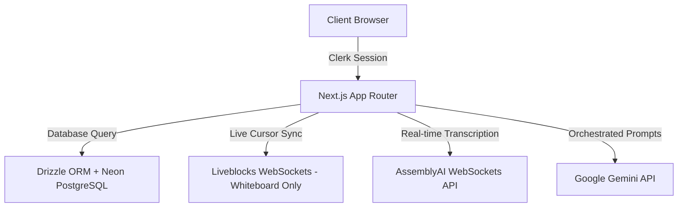

# Worko — AI-Powered Collaborative Workspace

[](https://nextjs.org/)
[](https://react.dev/)
[](https://www.typescriptlang.org/)
[](https://tailwindcss.com/)
[](https://orm.drizzle.team/)
[](https://www.postgresql.org/)
[](https://clerk.com/)
[](https://liveblocks.io/)
[](https://www.assemblyai.com/)
[](https://ai.google.dev/)
[](https://www.framer.com/motion/)
[](https://vitest.dev/)
[](https://github.com/features/actions)
[](https://opensource.org/licenses/MIT)

Worko is a premium, AI-powered collaborative productivity workspace designed for high-performance teams. It unites nested documentation wikis, Kanban boards, Neon PostgreSQL calendar events, collaborative SVGs whiteboards, AssemblyAI real-time speech dictation, and Gemini assistant agents into a unified, high-performance web experience.

---

## 🌟 Key Features

- 📄 **Spaces & Wikis**: Create nested page outlines, directory foldouts, and wiki documentation using the TipTap editor.
- 📋 **Kanban Boards**: Drag-and-drop task boards, checklist progress meters, priority indicators, and board customization settings. Stored in persisted Zustand stores and synchronized to Neon PostgreSQL.
- 📅 **Neon Calendar**: Create and manage scheduled meeting agendas in month or week views, directly synchronized to Neon PostgreSQL.
- 🎨 **Whiteboard Canvas**: Draw flows, mindmaps, text labels, and shapes with collaborative mouse cursors. Elements sync via Liveblocks room storage (`LiveMap`) and persist to database on a debounced delay.
- 🎙️ **Voice Notes Dictation**: Dictate notes directly at the TipTap cursor using AssemblyAI streaming sockets. Includes proper in-app permission checks and toast notices (no native blocking alerts).
- 🤖 **Gemini AI Assistant**: Plan strategical specifications, outline project roadmaps, refine note text, and generate custom template configurations. Gracefully falls back to a simulated typing stream if API keys are missing or invalid.
- 🔍 **Global Search**: Instantly query notes, kanban tasks, and calendar events using the `Cmd+K` / `Ctrl+K` command palette.
- 🔔 **Notifications**: Persistent notifications panel tracking read/unread alerts, backed by the database.
- ⚙️ **Settings Panels**: Configure themes, create custom workspace categories, toggle notification preferences, and review usage limits.

---

## 🏗️ Architecture System



---

## ⚙️ Tech Stack & Integrations

| Layer | Technologies |
| :--- | :--- |
| **Core Framework** | Next.js 16.2, React 19.2, TypeScript 5.6 |
| **Styling & Motion** | Tailwind CSS 4.0, Framer Motion 12.4 |
| **Database & ORM** | Neon PostgreSQL, Drizzle ORM 0.45 |
| **Authentication** | Clerk Auth 7.2 |
| **Multiplayer Sockets** | Liveblocks 3.21 (Collaborative Whiteboard Room Storage & Cursors) |
| **Generative AI** | Google Gemini (Refinement & Mini App Builder) |
| **Audio Processing** | AssemblyAI Stream Sockets (Live Speech Transcription) |
| **Testing** | Vitest 4.1, Testing Library React |
| **Continuous Integration** | GitHub Actions |

---

## 📂 Project Directory Structure

```text
├── .github/              # GitHub Actions workflows and CI configurations
├── app/                  # Next.js pages, API routes, and page-specific layouts
├── components/           # Reusable UI components (dashboard, kanban, whiteboard, ui primitives)
├── db/                   # Drizzle ORM schema, migration SQLs, and database connections
├── hooks/                # Custom React hooks (voice dictation)
├── lib/                  # Server Actions API contracts, helper logic, and types
├── tests/                # Vitest unit and integration test specs
└── package.json          # Dependency packages configurations
```

---

## ⚠️ Known Limitations

1. **Whiteboard Scoped Multiplayer**: Real-time collaboration, cursor layers, and Room state synchronization are strictly limited to the Whiteboard page. Outlines, notes, spaces, tasks, and calendars are single-player views backed by Neon database query operations.
2. **Search Indexing**: The Global Search command palette indexing matches notes, calendar events, and kanban tasks by title and description. It does not search whiteboard shapes, nested space directories, or individual task checklists.
3. **Persisted Notifications**: Notification records are added to the database when new calendar events are scheduled, but do not yet trigger for other actions like task additions or workspace creations.
4. **Voice notes scope**: AssemblyAI live speech transcription is exclusively active on the Notes editor page.

---

## 🧪 Testing & CI Pipeline

Worko uses a Vitest and React Testing Library setup to guarantee codebase stability.

- **Unit & Integration Tests**: Located in `tests/`, covering:
  - Auth Guard server action rejection.
  - Notes CRUD cycles.
  - Gemini Chat fallback simulated stream.
  - Core utility operations.
- **CI Build Pipeline**: The `.github/workflows/ci.yml` pipeline automatically runs on every push and PR to the `master` branch. It executes:
  1. ESLint check (`npm run lint`)
  2. TypeScript verification (`npx tsc --noEmit`)
  3. Unit test execution (`npm run test`)
  4. Next.js production build (`npm run build`)

---

## 🛠️ Local Installation & Development

### 1. Prerequisites
Ensure you have the following installed:
- Node.js (v20+)
- npm / yarn

### 2. Clone the Repository
```bash
git clone https://github.com/dakshgola/Worko.git
cd Worko
```

### 3. Install Dependencies
```bash
npm install
```

### 4. Setup Environment Variables
Create a `.env` file in the root directory and configure the variables:
```env
NEXT_PUBLIC_APP_URL=http://localhost:3000

DATABASE_URL=your_neon_postgresql_uri

NEXT_PUBLIC_CLERK_PUBLISHABLE_KEY=your_clerk_publishable_key
CLERK_SECRET_KEY=your_clerk_secret_key
NEXT_PUBLIC_CLERK_SIGN_IN_URL=/sign-in
NEXT_PUBLIC_CLERK_SIGN_UP_URL=/sign-up

LIVEBLOCKS_SECRET_KEY=your_liveblocks_secret_key
GEMINI_API_KEY=your_google_gemini_key
ASSEMBLYAI_API_KEY=your_assemblyai_key
```

### 5. Run Database Migrations
Push schemas directly to your Neon database instance:
```bash
npm run db:push
```

### 6. Start the Development Server
```bash
npm run dev
```
Open `http://localhost:3000` in your web browser.

---
