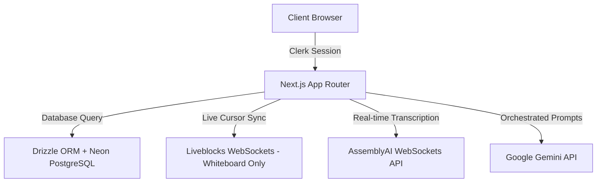

# Worko — Enterprise Collaborative & AI-Native Workspace

[](https://nextjs.org/)
[](https://react.dev/)
[](https://www.typescriptlang.org/)
[](https://tailwindcss.com/)
[](https://orm.drizzle.team/)
[](https://www.postgresql.org/)
[](https://clerk.com/)
[](https://liveblocks.io/)
[](https://www.assemblyai.com/)
[](https://ai.google.dev/)
[](https://www.framer.com/motion/)
[](https://vitest.dev/)

Worko is a high-performance, AI-native collaborative productivity workspace. It consolidates nested document wikis, kanban boards, shared team calendars, and collaborative vector whiteboards into a single unified workspace. The platform features real-time multiplayer cursor synchronization, live voice notes transcription, and context-aware generative AI agents.

Designed with a premium visual design system and clean responsive layouts, it is optimized for high-performance solo builders and small agile teams.

---

## 🏗️ System Architecture

The workspace leverages a modern hybrid architecture that couples Next.js Server Actions for relational CRUD operations with WebSocket streaming adapters for real-time collaboration.



---

## 🛠️ Key Engineering Highlights & Contributions

### 1. Real-Time Collaborative State Synchronization (Liveblocks + Postgres)
- **Problem**: Saving whiteboard elements to the database on every modification creates severe database locking and write bottlenecks.
- **Solution**: Developed a **hybrid sync engine**. Changes write instantly to Liveblocks Room Storage (`LiveMap`) for ultra-low latency client updates. A **debounced persist engine** runs locally on the client, batching changes and updating Neon PostgreSQL after 1000ms of inactivity, reducing DB writes by up to 90%.
- **Implementation**: Built dynamic canvas loading hooks that gracefully merge room storage templates, ensuring new database elements hydrate smoothly during session initialization.

### 2. Relative Coordinate Normalization for Freehand Path Vectors
- **Problem**: Storing absolute coordinates for freehand lines/strokes prevents moving or dragging them, as they snap back to their original draw positions.
- **Solution**: Designed a vector normalization algorithm. During pen drawing, absolute client-space points are collected. On mouse-up, the system calculates the tight bounding box $(x, y, w, h)$ of the stroke and transforms all drawing coordinates to **relative offsets** from the bounding box origin.
- **Impact**: Enables freehand drawings to be moved, scaled, and deleted utilizing the exact same cursor drag math used for standard shapes (rectangles/circles) without modifications to the Liveblocks or PostgreSQL schema models.

### 3. Asynchronous Audio Transcription Pipeline (WebSockets)
- **Problem**: Traditional transcription API calls require uploading audio files post-recording, causing lag and a poor user experience.
- **Solution**: Structured a live voice dictation hook using **AssemblyAI streaming sockets**. High-frequency audio chunks captured from the browser's audio stream are fed directly into the WebSocket connection.
- **Result**: Transcribed words stream directly to the cursor position in the TipTap rich text editor in near real-time, complete with robust local audio permission guards and toast error handling.

### 4. Contextual AI Agent (Gemini 2.5 Flash Integration)
- **Problem**: Narrow-scoped chatbots act as static, single-purpose agents that disrupt normal chat flows.
- **Solution**: Refactored the route layer to ingest custom system instructions. The assistant handles general productivity questions, refines document content, and generates diagrams, while maintaining session-specific memory (multi-turn conversation payload containing `user` and `model` roles).
- **Graceful Degradation**: Integrated client-side fallback mocks that emulate typing streams if API keys are missing or invalid, preventing app crashes.

---

## ⚖️ Architectural Decisions & Trade-Offs

### 1. Scoped Multiplayer Synchronization
- **Decision**: Scoped real-time WebSocket sync (Liveblocks) exclusively to the Whiteboard page. Spaces, tasks, and calendars use Next.js Server Actions with immediate database persistence.
- **Trade-off**: While notes are not co-authored in real-time, this decision significantly reduces socket overhead, minimizes connection costs, and simplifies state resolution logic, matching the performance profiles needed for small teams.

### 2. Persisted Client-Side State for Kanban Boards
- **Decision**: Leveraged local Zustand stores coupled with Server Action synchronizations.
- **Trade-off**: The board states are instantly responsive on client actions, running Dnd-Kit drag events without waiting for database responses. A failure to sync shows a non-blocking toast, maintaining UI responsiveness under flaky network conditions.

---

## ⚙️ Tech Stack & Integrations

| Layer | Technologies |
| :--- | :--- |
| **Core Framework** | Next.js 16.2 (App Router), React 19.2, TypeScript 5.6 |
| **Styling & Motion** | Tailwind CSS 4.0, Framer Motion 12.4 |
| **Database & ORM** | Neon PostgreSQL, Drizzle ORM 0.45 |
| **Authentication** | Clerk Auth 7.2 (Custom themed components) |
| **Multiplayer Sockets** | Liveblocks 3.21 (Collaborative Whiteboard Room Storage & Cursors) |
| **Generative AI** | Google Gemini (Content Refinement & Diagrams) |
| **Audio Processing** | AssemblyAI Stream Sockets (Live Speech Transcription) |
| **Testing Suite** | Vitest 4.1, Testing Library React |
| **CI / CD** | GitHub Actions |

---

## 🧪 Quality Assurance & CI Pipelines

Worko maintains a high quality floor using an automated test and build pipeline:

- **Unit & Integration Tests**: Specced in Vitest (`tests/`), verifying auth guard protection, notes CRUD cycles, conversation payloads, and core calendar calculations.
- **CI Workflow**: The `.github/workflows/ci.yml` pipeline runs on every push and PR to the `master` branch:
  1. Executes ESLint verification (`npm run lint`)
  2. Runs TypeScript type checks (`npx tsc --noEmit`)
  3. Executes Vitest test suites (`npm run test`)
  4. Confirms compilation with a Next.js production build (`npm run build`)

---

## 🛠️ Local Installation & Development

### 3. Install Dependencies
```bash
npm install
```

### 4. Configure Environment Variables
Create a `.env` file in the root directory:
```env
NEXT_PUBLIC_APP_URL=http://localhost:3000

# Database Connection
DATABASE_URL=your_neon_postgresql_uri

# Clerk Authentication
NEXT_PUBLIC_CLERK_PUBLISHABLE_KEY=your_clerk_publishable_key
CLERK_SECRET_KEY=your_clerk_secret_key
NEXT_PUBLIC_CLERK_SIGN_IN_URL=/sign-in
NEXT_PUBLIC_CLERK_SIGN_UP_URL=/sign-up

# Third-Party Integrations
LIVEBLOCKS_SECRET_KEY=your_liveblocks_secret_key
GEMINI_API_KEY=your_google_gemini_key
ASSEMBLYAI_API_KEY=your_assemblyai_key
```

### 5. Run Database Migrations
Push your schema tables to Neon PostgreSQL:
```bash
npm run db:push
```

### 6. Start the Development Server
```bash
npm run dev
```
Open `http://localhost:3000` in your web browser.
