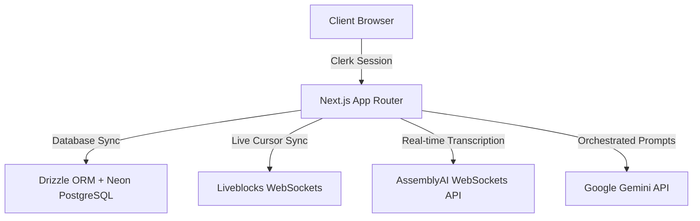

# Worko — AI-Powered Collaborative Workspace

[](https://nextjs.org/)
[](https://react.dev/)
[](https://www.typescriptlang.org/)
[](https://tailwindcss.com/)
[](https://orm.drizzle.team/)
[](https://www.postgresql.org/)
[](https://clerk.com/)
[](https://liveblocks.io/)
[](https://www.assemblyai.com/)
[](https://ai.google.dev/)
[](https://www.framer.com/motion/)
[](https://opensource.org/licenses/MIT)

Worko is a world-class, premium AI-powered collaborative productivity workspace designed for high-performance teams. It combines documentation wiki pages, Kanban boards, Neon PostgreSQL calendar events, infinite SVGs whiteboard drawing canvases, AssemblyAI speech dictation waveforms, and Gemini orchestrator actions into a unified SaaS experience.

---

## 🌟 Key Features

- 📄 **Spaces & Wikis**: Create nested page outlines, directory foldouts, and collaborative wiki docs using the TipTap editor.
- 📋 **Kanban Boards**: Drag-and-drop task items, checklists meters, priority badges, and board customization settings.
- 📅 **Neon Calendar**: Drag meetings agendas directly synced to a Neon PostgreSQL instance.
- 🎨 **Whiteboard Canvas**: Draw flows, mindmaps, and shapes with collaborative mouse cursor layers.
- 🎙️ **Voice notes dictation**: Dictate audio transcripts live at your editor cursor using AssemblyAI streaming sockets.
- 🤖 **Gemini AI assistant**: Analyze strategic specs, plan project roadmaps, and generate custom tracker configs in seconds.
- ⚙️ **Settings Tab panels**: Securely configure theme toggles, categories labels, limit metrics usage charts, and Clerk sign out hooks.

---

## 🏗️ Architecture System



---

## ⚙️ Tech Stack & Integrations

| Layer | Technologies |
| :--- | :--- |
| **Core Framework** | Next.js 15, React 19, TypeScript |
| **Styling & Motion** | Tailwind CSS, Framer Motion |
| **Database & ORM** | Neon PostgreSQL, Drizzle ORM |
| **Authentication** | Clerk Auth |
| **Realtime Sockets** | Liveblocks Collaborative Cursor Layers |
| **AI Processing** | Google Gemini (Refinement & Builders) |
| **Audio Processing** | AssemblyAI Stream Sockets (Live Dictation) |

---

## 📂 Project Directory Structure

```text
├── app/                  # Next.js pages, api routes and metadata
├── components/           # Reusable visual components and workspace layouts
├── lib/                  # Server Actions API contracts and logic states
├── public/               # Static assets and icons vectors
├── package.json          # Dependency packages configurations
└── README.md             # Flagship repository documentation
```

---

## 🛠️ Local Installation & Development

### 1. Prerequisites
Ensure you have the following installed:
- Node.js (v20+)
- npm / yarn

### 2. Clone the Repository
```bash
git clone https://github.com/dakshgola/Worko.git
cd Worko
```

### 3. Install Dependencies
```bash
npm install
```

### 4. Setup Environment Variables
Create a `.env` file in the root directory and configure the variables:
```env
NEXT_PUBLIC_CLERK_PUBLISHABLE_KEY=your_clerk_key
CLERK_SECRET_KEY=your_clerk_secret

DATABASE_URL=your_neon_postgresql_uri

LIVEBLOCKS_SECRET_KEY=your_liveblocks_secret

GEMINI_API_KEY=your_google_gemini_key

ASSEMBLYAI_API_KEY=your_assemblyai_key
```

### 5. Start the Development Server
```bash
npm run dev
```
Open `http://localhost:3000` in your web browser.

---

## 🚀 Future Roadmap
- 📊 Advanced Gantt timeline dashboards widgets.
- 📱 Native iOS and Android notifications sync.
- 🔒 Custom SAML SSO enterprise sign-in configurations.

---

## 📄 License
This project is licensed under the MIT License — see the [LICENSE](LICENSE) file for details.

---

## 👥 Authors & Social Links
- **GitHub**: [dakshgola](https://github.com/dakshgola)
- **LinkedIn**: [Daksh Gola](https://linkedin.com/in/dakshgola)
